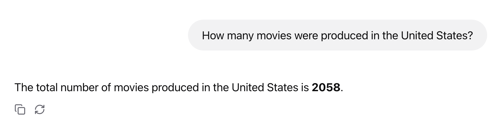

# Simple Text to SQL (No RAG)

[](https://github.com/JavaAIDev/simple-text-to-sql/actions/workflows/build.yaml)

> See JavaAIDev [article](https://javaaidev.com/docs/rag/samples/text-to-sql) for more details.

Test
data: [Netflix data](https://github.com/neondatabase/postgres-sample-dbs?tab=readme-ov-file#netflix-data)

How to run:

1. Requires Java 21 to build and run.
2. Start Postgres database using Docker Compose.
3. Start the server and use [Chat Agent UI](http://localhost:8080/webjars/chat-agent-ui/index.html)
   to run query.

Sample query:

```text
How many movies were produced in the United States?
```

Output:

```text
The total number of movies produced in the United States is 2058.
```

See the screenshot below.



## Full Text-to-SQL Implementation

For a complete Text-to-SQL implementation, check out
my [course](https://www.udemy.com/course/spring-ai-text-to-sql/?referralCode=6180D9A02FA8BA9D4F60).